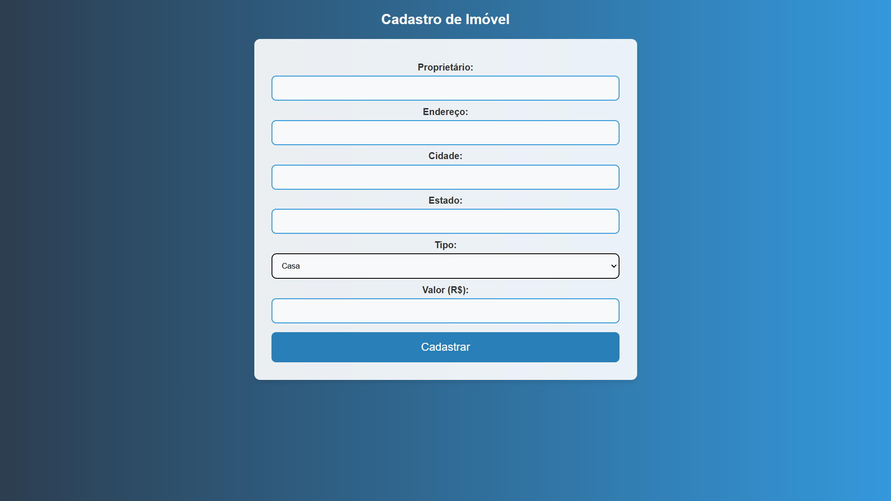
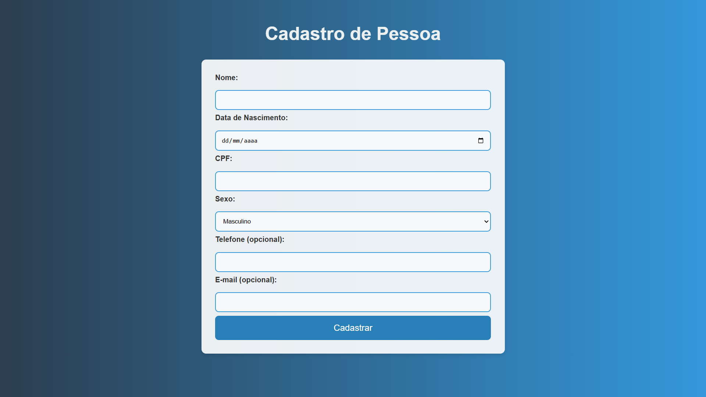
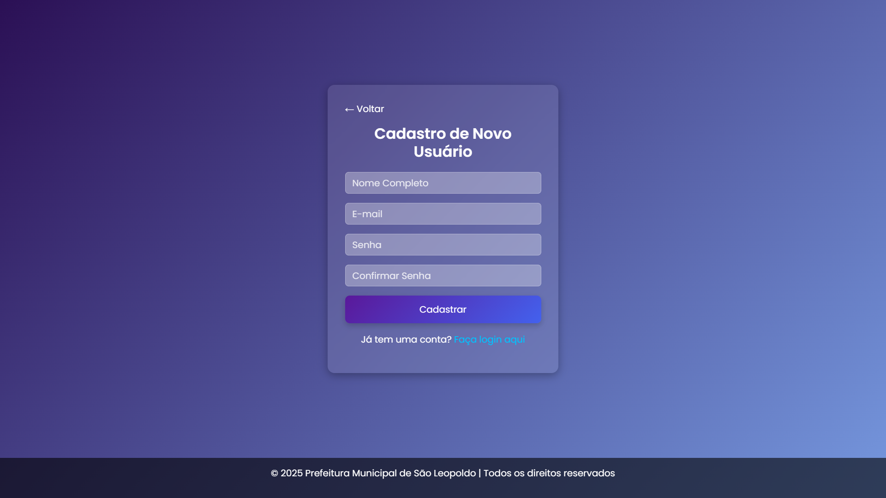
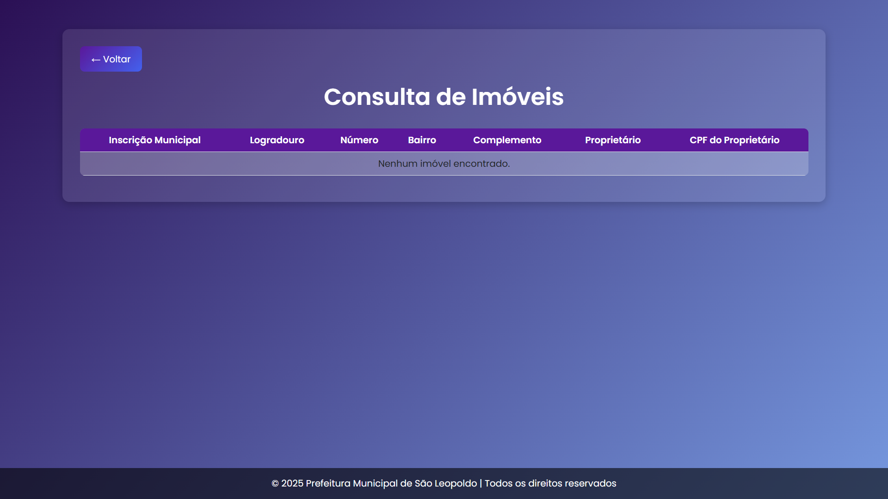
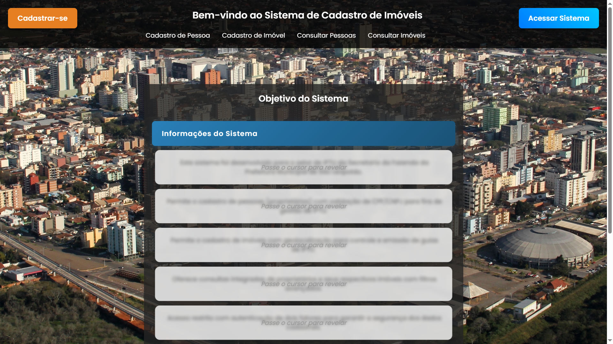
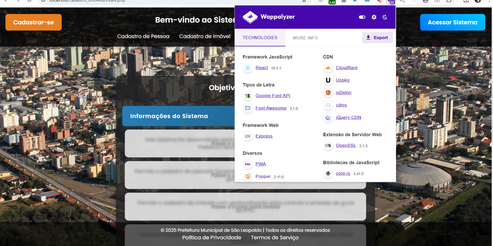

# Sistema de Imóveis

Aqui está a descrição do meu sistema de cadastro de imóveis, com diversas funcionalidades para cadastrar, consultar e editar imóveis e usuários.

## Imagem do Sistema


Essa é a imagem do sistema em funcionamento, mostrando o processo de cadastro e visualização de imóveis.

## Mais Imagens



Essa é a tela para cadastro de um imóvel no sistema.



Aqui temos a tela de cadastro de uma pessoa no sistema.



Esta é a tela para cadastrar um usuário no sistema.



Tela de consulta de imóveis cadastrados no sistema.


Esta é a tela de consulta das pessoas cadastradas no sistema.



Imagem adicional do sistema mostrando detalhes importantes de navegação e funcionalidades.



Esta imagem fornece detalhes sobre o processo de criação do sistema.


# 📌 Sistema de Cadastro de Imóveis

Este é um sistema para cadastro e gerenciamento de imóveis, desenvolvido com PHP, MySQL e Node.js.

## 🚀 Instalação e Configuração

### 📥 1. Clonar o Repositório

Abra o terminal e execute o seguinte comando:

```bash
git clone https://github.com/gabrielmoraespro/Sistema_cadastro_imoveis.git
cd Sistema_cadastro_imoveis
```

### 🛠 2. Configurar o Ambiente

O projeto requer as seguintes ferramentas instaladas:

- [Git](https://git-scm.com/downloads) para controle de versão
- [Node.js](https://nodejs.org/) para execução do backend
- [Yarn](https://yarnpkg.com/getting-started/install) (ou npm) para gerenciamento de pacotes
- [XAMPP](https://www.apachefriends.org/pt_br/index.html) ou [WAMP](https://www.wampserver.com/en/) para o servidor web

Verifique se o Node.js e o gerenciador de pacotes estão instalados executando:

```bash
node -v  # Deve retornar a versão do Node.js
yarn -v  # Ou npm -v para verificar o gerenciador de pacotes
```

### 📦 3. Instalar Dependências

Instale as dependências do projeto executando:

```bash
yarn install  # Ou npm install
```

Se houver dependências PHP gerenciadas pelo Composer, instale-as com:

```bash
composer install
```

### 🗄 4. Configurar o Banco de Dados

1. Crie um banco de dados MySQL.
2. Importe o arquivo `cadastroimoveis.sql` localizado na raiz do projeto.
3. Atualize o arquivo `config.php` com as credenciais do banco de dados:

```php
<?php
define('DB_SERVER', 'localhost');
define('DB_USERNAME', 'seu_usuario');
define('DB_PASSWORD', 'sua_senha');
define('DB_NAME', 'nome_do_banco');
?>
```

### ▶️ 5. Executar o Projeto

1. Inicie o servidor web.
2. Inicie o backend com:

```bash
yarn start  # Ou npm start
```

3. Acesse o sistema no navegador: [`http://localhost/Sistema_cadastro_imoveis`](http://localhost/Sistema_cadastro_imoveis).

## ✨ Recursos

✅ Cadastro de imóveis 🏠  
✅ Consulta e edição de registros 🔍  
✅ Sistema seguro e eficiente 🔐

## 📝 Licença

Este projeto está sob a licença MIT. Sinta-se livre para contribuir!

---
💡 *Desenvolvido por Gabriel Moraes*
